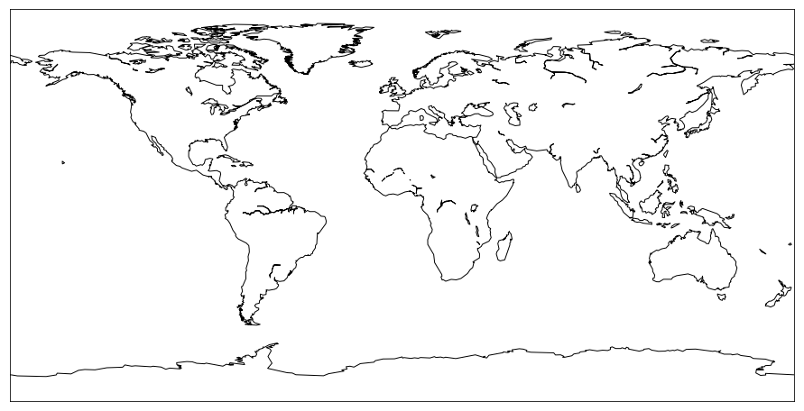
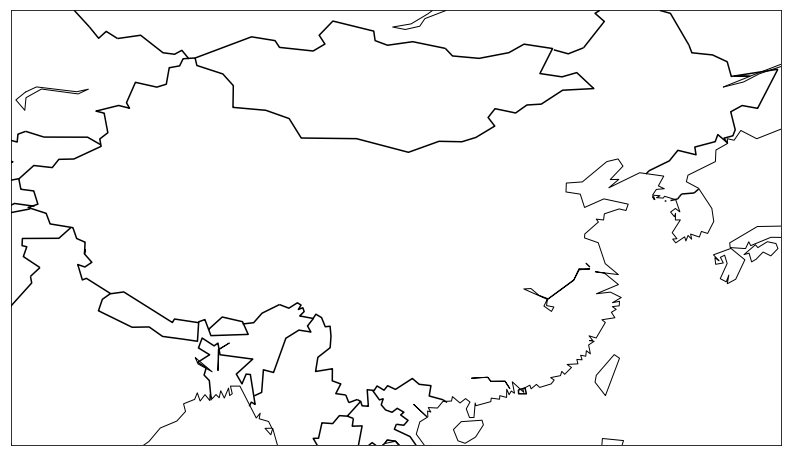
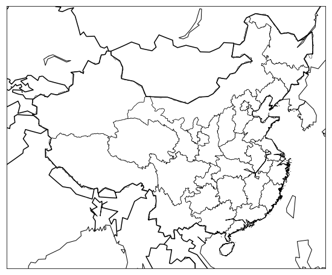
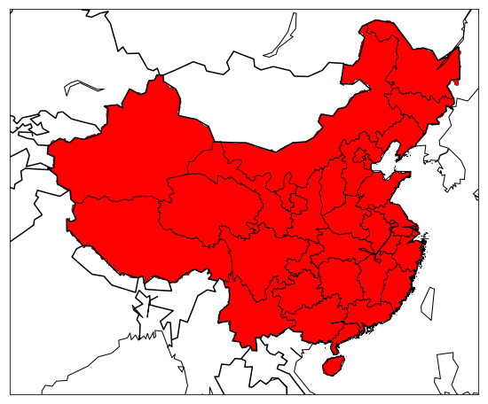
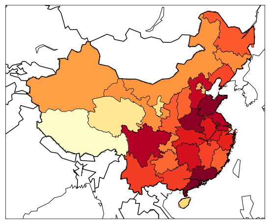

# Draw_China_Map

## Pandas

如果我让你读取一个csv文件，然后求每一列数据的平均值，最大值，最小值，方差，用Java或PHP怎么做？你首先要fopen一个文件，然后一行一行读进来，再给它整个数据结构，然后弄个循环计算，最后你可能还要fclose这个文件。总之代码一坨，麻烦死。而Python语言因为有Pandas这个神器，一行代码搞定：
```
df = pd.read_csv('a.csv')
```
行了，从此以后，df就是这个DataFrame，它本身就是一个强大的数据结构，也可以把它理解成mysql数据库中的一张表吧，各种增删改查，求总和，求平均都是一行代码的事情。所以有这样强大的库，研究人员有什么理由选择Java？

## scikit-learn

一般缩写为sclearn，各种机器学习算法，基本上只要你能想得到的，线性回归，逻辑回归，SVM，随机森林，最近邻居等等等等，各种算法全部在这里面，简而言之，只有你想不到，没有它做不到，不详述。所以这就是为什么玩机器学习必选Python的原因，你给我找一个Java或者PHP有这样多种算法的库来？

## matplotlib

matplotlib配合Basemap画一个中国地图。

## Basemap

先安装相应的组件。我假定你已经都安装好了Python以及Jupyter等等。
如果没有安装的话，就去尝试一下brew install python3和brew install jupyter吧，网上有很多教程。

然后你需要用pip3 install很多我们下面可能需要用到的库。但是因为我们要用一个叫做Basemap的库，而这个库没有办法用简单的pip3 install安装，所以稍多两个步骤：
```
brew install geos
pip3 install https://github.com/matplotlib/basemap/archive/v1.1.0.tar.gz
```
### 开始画图

```
import matplotlib.pyplot as plt
from mpl_toolkits.basemap import Basemap

plt.figure(figsize=(16,8))
m = Basemap()
m.drawcoastlines()

plt.show()
```


```
m = Basemap(llcrnrlon=73, llcrnrlat=18, urcrnrlon=135, urcrnrlat=53)
```


我们想加上省的边界怎么办呢？Basemap缺省的包里没有中国的省区，只有美国的州，毕竟是美国人做的嘛。不过好在世界很大，有专门的国际组织干这事，在这里你可以下载全世界任何一个国家的行政区划Shape文件，然后我们给它加上：
https://gadm.org/download_country_v3.html
```
m.readshapefile('CHN_adm_shp/CHN_adm1', 'states', drawbounds=True)
```


### 上色

```
from matplotlib.patches import Polygon

ax = plt.gca()
for nshape, seg in enumerate(m.states):
    poly = Polygon(seg, facecolor='r')
    ax.add_patch(poly)
    
```


### 输出数据--关于台湾

```
for shapedict in m.states_info:
    statename = shapedict['NL_NAME_1']
    p = statename.split('|')
    if len(p) > 1:
        s = p[1]
    else:
        s = p[0]
    print(s)
for shapedict in m.taiwan_info:
    s = shapedict['NAME_CHINE']
    print(s)
```
### 渲染 https://matplotlib.org/examples/color/colormaps_reference.html

```
cmap = plt.cm.YlOrRd
然后我们把每个省的数据映射到colormap上：

colors[s] = cmap(np.sqrt((pop - vmin) / (vmax - vmin)))[:3]
最后，我们把各个省的颜色描在地图上：

color = rgb2hex(colors[statenames[nshape]])
poly = Polygon(seg, facecolor=color, edgecolor=color)
```



